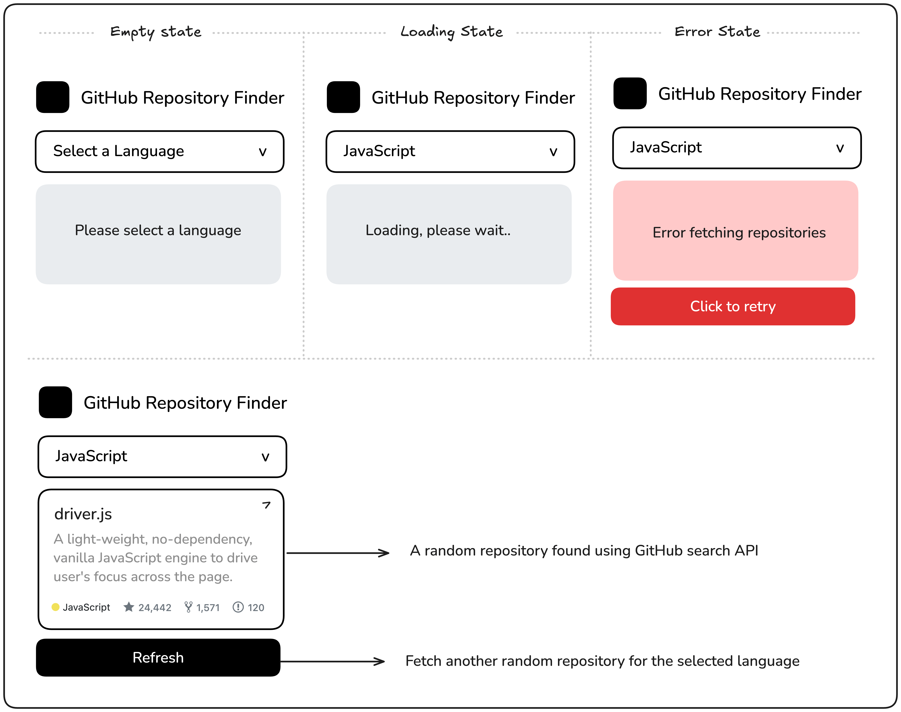

# Clase: Introducción al trabajo con APIs externas y manejo de estados de UI en JavaScript

### Objetivo de la clase:

En esta lección, aprenderás a crear una aplicación web que se conecta a una API externa, gestiona solicitudes asincrónicas y maneja diferentes estados de la interfaz de usuario (UI) como carga, errores y resultados vacíos. Desarrollaremos una aplicación que permite a los usuarios seleccionar un lenguaje de programación, buscar repositorios aleatorios de GitHub que usen ese lenguaje y mostrar información clave sobre el repositorio.

### Enuncia del problema:

Tu misión es crear un buscador de repositorios de GitHub que permita a los usuarios seleccionar un lenguaje de programación de un menú desplegable. La aplicación usará la API de búsqueda de repositorios de GitHub para obtener y mostrar un repositorio aleatorio que coincida con el lenguaje seleccionado. La información mostrada incluirá el nombre del repositorio, descripción, número de estrellas, bifurcaciones (forks) y problemas abiertos. Después de mostrar un repositorio, un botón de "Refrescar" permitirá obtener otro repositorio al azar. Debes asegurarte de manejar los estados de carga, error y vacíos de manera efectiva.

### Recursos:

Listados de lenguajes: (https://raw.githubusercontent.com/kamranahmedse/githunt/master/src/components/filters/language-filter/languages.json)

API de búsqueda de repositorios de GitHub: (https://api.github.com/search/repositories?q=language:javascript&sort=stars&order=desc')

Interfaz de usuario (UI) de la aplicación:
